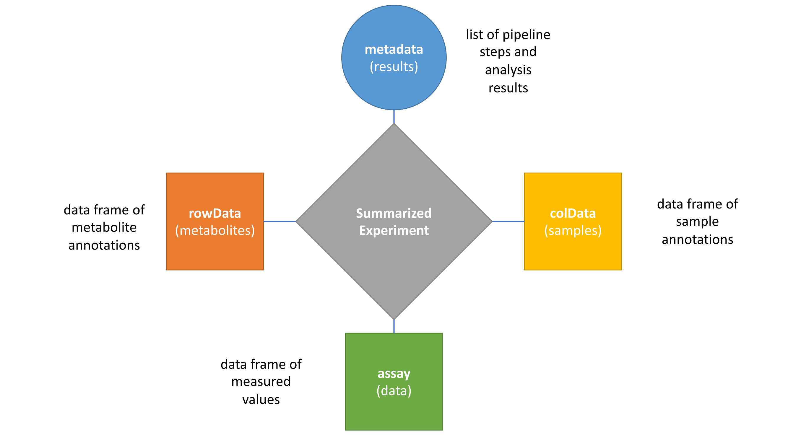

# maplet Reference Guide

This document provides an overview of the maplet R package. It is
divided into three main sections: **Build Pipelines** (this is the section
for users - if don't read anything else, read this), **Access Results**, and
**Development**.

# 1. Build Pipelines

maplet is an R package for statistical data analysis with a special
focus on metabolomics datasets. It allows users to create self-contained
analytical pipelines. The toolbox builds upon the bioconductor package
[SummarizedExperiment](https://bioconductor.org/packages/release/bioc/vignettes/SummarizedExperiment/inst/doc/SummarizedExperiment.html)
(SE), which serves as a central repository for each pipeline's data,
analysis steps, and results. maplet provides a suite of functions for
interacting with this container including but not limited to data
loading, annotation, statistical analysis, visualization, and reporting.
maplet is designed to work with a pipe operator - either %\>% from the
[magrittr](https://magrittr.tidyverse.org/) package or the \|\>
operator in base R. The pipe operator allows for smooth connections
between pipeline steps, without the need for temporary variables or
multiple assignments. The combination of these three elements allows for
the creation of pipelines which are simple to follow, highly modular,
and easily reproducible.

Functions are divided into two broad categories: **Starting Functions**
and **Non-Starting Functions**. Starting functions are a specialized set
of functions that create a pipeline object, while non-starting functions
accept a pipeline object and encompass all other functions. Only
starting functions can be used at the beginning of a maplet pipeline.
Functions are further divided into distinct namespaces denoted by the
first two terms of a functions name. These are **mt_anno**,
**mt_clean**, **mt_load**, **mt_modify**, **mt_plots**, **mt_post**,
**mt_pre**, **mt_reporting**, **mt_stats**, and **mt_write**.
Descriptions of these namespaces and further details are provided in the
sections below.

## 1.1. Starting Functions

Starting functions can be used as the beginning of a maplet pipeline.
They will create a new pipeline object if none is provided. Starting
functions consist of **Loading** and **Data-Independent** functions.

### 1.1.1. Loading Functions (**mt_load**)

Loading functions are denoted by the prefix **mt_load**. They generate
pipeline objects and populate the assay, rowData, and colData data
frames using the data from user-provided input files. They are also
capable of accepting a pipeline object for special cases in which
loading the data is not the first step in the pipeline (for example,
`mt_settings` can be used to set the global settings for the pipeline
before the data is loaded). If accepting a pipeline object, all of the
data frames must be empty - otherwise the loading function will crash.

maplet's loading functions are designed to work with standardized data
formats, such as those provided by metabolon (`mt_load_metabolon_v1`) and
UC Davis (`mt_load_ucd`). See the maplet package documentation for a full
list of compatible formats.

### 1.1.2. Data-Independent Functions

Data-Independent functions do not require the pipeline object data
frames (e.g. assay) to be populated in order to perform their
operations. These functions make up a set of commands one may wish to
use before a dataset is loaded. For example, `mt_load_checksum` can be
used to ensure a file to be loaded has not been altered before loading
it into the pipeline. When used as the first step in a pipeline, these
functions generate pipeline objects, but leave the assay, rowData, and
colData data frames empty. They are limited to the following list:

-   `mt_settings` - sets and outputs global pipeline settings

-   `mt_load_checksum`\* - calculates the MD5 checksum of a file; if a
    checksum is provided by the user, it will be compared to the
    calculated checksum and the pipeline will crash if it does not match

-   `mt_reporting_heading` - stores a header and heading level to be used
    in the generated html report

\*NOTE: `mt_load_checksum` is part of the **mt_load** namespace, but is
NOT a loading function. It is associated with the namespace because it
evaluates the checksums of files to be loaded by one of the loading
functions.

## 1.2. Non-Starting Functions

Non-starting functions encompass the majority of maplet functions. These
must be provided with a pipeline object with populated data frames. They
are divided into 9 categories based on the actions they perform on a
maplet object and each category is denoted by a specific prefix. These
are annotation (**mt_anno**), data modification (**mt_modify**),
plotting (**mt_plots**), preprocessing (**mt_pre**), statistical
analysis (**mt_stats**), post-test operations (**mt_post**), reporting
(**mt_reporting**), pipeline clean-up (**mt_clean**), and data output (**mt_write**).

### 1.2.1. Annotation (**mt_anno**)

Annotation functions are denoted by the **mt_anno** prefix. These
functions add new or modify existing rowData or colData columns. There
are four subtypes of annotation functions: **1.2.1.1** **map annotations
to rowData / colData**, **1.2.1.2** **calculations**, **1.2.1.3**
**modify / modify-in-place**, and **1.2.1.4 pathways**.

#### 1.2.1.1. Map Annotations to rowData / colData data frames

These functions map an existing ID column in the rowData or colData data
frame to an ID column from an external data frame in order to add one or
more new annotation columns. An example is `mt_anno_xls` which maps an
existing ID column in rowData or colData to a user-provided .xlsx file
containing a data frame of new annotation columns.

#### 1.2.1.2. Calculations

These functions perform calculations on the assay data frame and add the
results as a new column to either rowData or colData. An example is
`mt_anno_missingness` which calculates the percent missingness of features
and samples.

#### 1.2.1.3. Modify / Modify-In-Place

These functions apply terms or functions to an existing column in
rowData or colData. Some functions modify the column in place (e.g.
`mt_anno_reorder_factor`) or add a new column with the results of the
modification (e.g. `mt_anno_mutate`).

#### 1.2.1.4. Pathways (**mt_anno_pathways**)

Functions with the prefix **mt_anno_pathways** add a column containing
pathway IDs to the rowData data frame. They use an existing feature
identifier column to fetch pathways from either a custom system file
(e.g. `mt_anno_pathways_hmdb`), a user-provided file (e.g.
`mt_anno_pathways_xls`) or a pathway annotation package (e.g.
`mt_anno_pathways_graphite`). Since multiple pathways can be associated
with a single feature, the columns created using these functions contain
lists of pathway IDs.

Pathway annotations are highly redundant - features can belong to
multiple pathways and a given pathway contains multiple features. maplet
provides the special function `mt_anno_pathways_remove_redundant` to
filter redundant pathways in the rowData data frame.

In addition to the annotation column added to the rowData data frame,
pathway annotation functions create a companion data frame containing
information about the total and measured metabolites in a pathway. It is
stored in the SE metadata inside a named list called "pathways". See
section [3.4 Storing Pathway
Annotations](#34-storing-pathway-annotations) for further details.

### 1.2.2. Modify Dataset (**mt_modify**)

Modify functions are denoted by the prefix **mt_modify**. They allow
users to make modifications to the assay data and update the rowData and
colData data frames to reflect those changes. Below is a list of the
type of changes users can make and the functions to use to make them.

#### 1.2.2.1. Filter or Combine Samples / features

maplet provides functions to combine duplicate samples or features in
the assay data frame. These functions identify duplicate entries using a
column from their respective annotation data frames and combine them by
averaging the values between duplicate entries. They are primarily
intended for use with replicates.

There are also functions (e.g. `mt_modify_filter_features` or
`mt_modify_filter_samples`) that utilize user-provided logical expressions
to filter and remove samples or features from the assay data frame and
corresponding annotation data frame. The rows of the annotation data
frame are filtered based on the results of the expression and filtering
is carried over to the corresponding columns or rows of the assay data
frame.

#### 1.2.2.2. Special Group Calculations

Certain **mt_modify** functions are only applicable in situations in
which the dataset can be divided into distinct classes. In such cases,
the assay data frame is subset and replaced with the result of the group
calculation. For example, the function `mt_modify_diff_groups` subsets the
assay data into two groups (grp1 and grp2) and replaces the existing
assay data frame with the difference of the first minus the second.

#### 1.2.2.3. Replace Features with New Variable

maplet is intended primarily to work with one particular format, namely,
an assay with columns as samples and rows as features. However, there
are situations in which it is desirable to analyze a different variable
per sample. maplet provides functions to transform the assay and rowData
data frames such that 'features' are represented by new variables. For
example, the function `mt_modify_agg_pathways` uses the pathway annotation
column to build a new data matrix in which 'features' are represented by
pathways.

### 1.2.3. Visualize (**mt_plots**)

Functions with the **mt_plots** namespace allow users to visualize data
using a variety of plot types. These functions are categorized based on
the type of data they work with.

#### 1.2.3.1. Assay Data

maplet provides a variety of functions for visualizing the structure of
the data. These functions are particularly useful for getting a global
overview of the data and are commonly used during preprocessing of the
data. Types of data visualizations include dimensionality reduction
(e.g. `mt_plots_pca` or `mt_plots_umap`), missingness (e.g.
`mt_plots_missingness`), heatmap (e.g. `mt_plots_heatmap`), and sample box
plots (e.g. `mt_plots_sample_boxplot`).

#### 1.2.3.2. Statistical Results

maplet provides a variety of functions for visualizing the results of
statistical tests. Types of visualizations for statistical results
include p-value comparisons (e.g. volcano plots and QQ plots),
comparison of multiple statistics via heatmaps, and box / scatter plots
of significant results.

#### 1.2.3.3. Pathways

maplet provides several functions for visualizing pathway data. For
example, `mt_plots_pathview` is a wrapper function for the pathview
function from the
[pathview](https://bioconductor.org/packages/release/bioc/html/pathview.html)
package that allows users to visualize pathways as graphs and color
features present in the data by relative significance. Another example
is `mt_plots_equalizer` which creates a nested plot based on pathway
feature annotations (e.g. super- and sub-pathways or subpathways and
features).

#### 

### 1.2.4. Preprocess (**mt_pre**)

Functions in this namespace allow the user to perform typical
preprocessing operations on the data. There are currently six types of
preprocessing functions implemented inmaplet: **correction**,
**imputation & zero replacement**, **filtering**, **outlier detection**,
and **data** **transformation**.

#### 1.2.4.1. Correction

There are two types of data correction methods available: batch and
confounder.

Batch correction functions are denoted by the prefix **mt_pre_batch**.
They perform batch correction on the assay data frame using one of the
available methods (e.g. `mt_pre_batch_combat`).

Confounding correction functions are denoted by the prefix
**mt_pre_confounding_correction**. They correct for confounders using
one of the available methods (e.g.
`mt_pre_confounding_correction_stepaic`).

#### 1.2.4.2. Normalization (**mt_pre_norm**)

Functions with the prefix **mt_pre_norm** perform normalization of the
data. An example is `mt_pre_norm_quot` which performs quotient
normalization of the data.

#### 1.2.4.3. Imputation & Zero Replacement

Imputation functions are denoted by the prefix **mt_pre_impute**. maplet
primarily provides the K-Nearest Neighbor (KNN) method to impute missing
values (e.g. `mt_pre_impute_knn`).

maplet pipelines represent missingness as NA values. Data from platforms
that represent missing / sub-LOD values as zeros must be converted after
loading using the function `mt_pre_zero_to_na` to replace these zeros with
NA values.

#### 1.2.4.4. Filter Missingness

These functions filter either samples or features by a user-defined
missingness threshold.

#### 1.2.4.5. Outlier Detection

These functions detect or flag outliers. There are several methods for
detecting outliers, including univariate and Mahalanobis distance. In
order to remove outliers, one of these flagging functions has to be
called first, followed by a filtering step.

#### 1.2.4.6. Data Transformation (**mt_pre_trans**)

Data transformation functions are denoted by the prefix
**mt_pre_trans**. These include such operations as log transformation
(`mt_pre_trans_log`) and scaling (`mt_pre_trans_scale`).

### 1.2.5. Statistical Analysis (**mt_stats**)

Statistical analysis functions are denoted by the prefix **mt_stats**.
They perform a variety of statistical analyses on the assay data. The
following subsections describe the types of analyses available.

#### 1.2.5.1. Univariate Models (**mt_stats_univ**)

Functions with the prefix **mt_stats_univ** perform univariate
statistical analysis. Note that methods in this category can be
multi*variable* (e.g. linear regression models with confounders),
but not multi*variate*. That is they will calculate a separate
model for each individual feature. maplet provides a variety of
functions for univariate analysis, including linear models
(`mt_stats_univ_lm`) and correlation (`mt_stats_univ_cor`).

#### 1.2.5.2. Correlation Matrix Models (**mt_stats_cormat**)

Functions with the prefix **mt_stats_cormat** calculate correlation
matrices. An example is `mt_stats_coramt_genenet`, which computes partial
correlations using GeneNet.

#### 1.2.5.3. Pathway Analyses (**mt_stats_pathway**)

Functions with the prefix **mt_stats_pathway** allow the user to perform
pathway analysis. An example is `mt_stats_pathway_enrichment`, which
computes the pathway enrichment using Fisher's exact test.

### 1.2.6. Post-Test Operations (**mt_post**)

Post-test functions are denoted by the prefix **mt_post**. They perform
post-hoc tests on the statistical results table generated by
**mt_stats** functions. They add a column with the results of the
post-hoc test directly to the table of the statistical result they are
computed on. There are three types of post-hoc tests available:

-   **multiple testing correction** - adjust p-values for multiple
    tests; multiple methods available (e.g. `mt_post_multtest`)

-   **fold changes** - calculate fold changes for a statistical result
    of two-group comparisons (e.g. `mt_post_fc`)

-   **p-gains** - calculate the increase in strength of association when
    using feature ratios (e.g. `mt_post_pgain`)

### 1.2.7. Reporting (**mt_reporting**)

Reporting functions are used in reporting the current state of the
pipeline via console log entries and generating HTML summary reports.
There are four types of **mt_reporting** functions: **text elements**,
**HTML Generators**, **data / result description,** and **timing**.

#### 1.2.7.1. Text Elements

These functions add strings and headers to the HTML reports.

#### 1.2.7.2. HTML Generators (**mt_reporting_html**)

HTML reports are the main form of output used in a maplet pipeline. They
provide a comprehensive overview of each step in the pipeline and
displays the results generated by the **mt_plots** and **mt_stats**
functions. The HTML generator functions are denoted by the prefix
**mt_reporting_html**. Functions exist for handling both single pipeline
objects (linear pipelines) or multiple pipeline objects (non-linear
pipelines).

#### 1.2.7.3. Data / Result Description

These functions create log entries describing the information about the
data (at time function was called in the pipeline) or a statistical
result. These entries are stored in the pipeline results as well as
output to the console during runtime. Examples include
`mt_reporting_data`, which reports the numbers of samples, features, and
the number of columns in each annotation data frame.

#### 1.2.7.4. Timing

maplet provides a timing functionality for pipelines using the tictoc
package. Users can start timing with the function `mt_reporting_tic` and
end timing with the function `mt_reporting_toc`.

### 1.2.8. Write (**mt_write**)

Write functions are denoted by the prefix **mt_write**. They allow the
user to output elements of the pipeline object to external files at any
point in the pipeline. Examples include `mt_write_se_xls` (writes assay,
rowData, and colData data frames to an Excel file) and `mt_write_se_rds`
(saves the pipeline object to an R data file).

### 1.2.9. Clean Up Pipeline (**mt_clean**)

Functions with the prefix **mt_clean** are used to "tidy up" a pipeline
object, for example by eliminating extraneous data or results. Examples
include `mt_clean_fix_ggplot` (converts plots saved as ggplot env to
images) and `mt_clean_remove_results` (allows the user to delete elements
from the metadata(D)\$result list).

# 2. Accessing Results 

This is when you want to access results being generated and want to
continue outside your maplet pipeline code. This is NOT the
visualization with the HTML generator.

## 2.1. Meta Functions (**mtm\_**)

Meta functions - denoted by the prefix **mtm\_** - are specialized
functions to access elements of the pipeline. These functions are not
pipeline functions themselves and need to be called separately. There is
currently one type of meta function: **accessors**.

### 2.1.1 Accessors

These meta functions allow the user to directly access the contents of
the results list in the pipeline object metadata. They include the
following:

-   `mtm_get_stat_by_name` - retrieves statistical results from
    **mt_stats** call stored in the pipeline by the supplied name

-   `mtm_res_get_entries` - extracts metadata(.)\$results in a given
    namespace of arbitrary depth; e.g. `mtm_res_get_path(path="plots")`
    returns all plot objects, while `mtm_res_get_path(path=c("plots",
    "box"))` returns all plot objects generated by functions of the
    namespace **mt_plots_box**; refer to section [3.3 Storing Pipeline
    Steps and Results in
    metadata](#33-storing-pipeline-steps-and-results-in-metadata) for
    information on the \$results structure

-   `mtm_res_get_plots` - returns all plots from each **mt_plots** entry
    in metadata(.)\$results list

-   `mtm_plot_all_tofile` - opens a device and exports all plots (from SE
    or list of plots) to a file (e.g. pdf)

-   `mtm_res_get_uuids` - extract all UUIDs for each function call

-   `mtm_res_get_ptrs` - extract all assay pointers for each function call

-   `mtm_get_assay_by_id` - return a specific assay version given a UUID
    or a tag name; refer to section [3.5 Storing Assay
    Versions](#35-storing-assay-versions) for further details

-   `mtm_get_assay_by_ptr` - retrieve a particular assay version given a
    "pointer" value; refer to section [3.5 Storing Assay
    Versions](#35-storing-assay-versions) for further details

NOTE: Although these are meta functions, they can also be utilized for
internal operations by **mt\_** functions. `mtm_get_stat_by_name` and
`mtm_res_get_entires` are often utilized in this way.

# 3. For Developers

This section is intended for package developers. It contains information
regarding the structure, conventions, and internal operations of the
package. The topics discussed below are not necessary to understand in
order to use the maplet package.

**NOTE:** For those wishing to contribute to the development of maplet,
please refer to the ReadMe section "Want to Get Involved?" to get
started.

## 3.1. Data Structure**

### 3.1.1. Overview

The maplet package creates self-contained pipelines utilizing the
container object from the bioconductor package
[SummarizedExperiment](https://bioconductor.org/packages/release/bioc/html/SummarizedExperiment.html).
This object has four components: assay, rowData, colData, and metadata.

maplet uses the SummarizedExperiment object as intended by the authors -
i.e. with samples in columns and variables in rows.The following
sections provide descriptions of how the four components are utilized by
maplet.

### 3.1.2. assay

The assay component of the SummarizedExperiment object is a data frame
containing the measured values for each feature in every sample. maplet
always stores measured values with features as rows and samples as
columns. The data frame can be easily accessed and manipulated from the
SummarizedExperiment container using the assay() function. Although
SummarizedExperiment objects allow for multiple assays, maplet is
designed to use only a single assay at a time.

### 3.1.3. rowData - feature annotations

The rowData component of the SummarizedExperiment object is a data frame
containing annotations for each of the measured features. The number of
rows in the rowData data frame is equal to the number of rows in the
assay data frame. The data frame can be easily accessed and manipulated
from the SummarizedExperiment container using the rowData() function.

### 3.1.4. colData - sample annotations

The colData component of the SummarizedExperiment object is a data frame
containing annotations for each of the measured samples. The number of
rows in the colData data frame is equal to the number of columns in the
assay data frame. The data frame can be easily accessed and manipulated
from the SummarizedExperiment container using the colData() function.

### 3.1.5. metadata - pipeline steps and analysis results

The metadata component of the SummarizedExperiment object is a list
which in maplet, by internal convention, contains up to five elements:

-   **results** - a list containing the pipeline steps and results; see
    section [***3.3 Storing Pipeline Steps and Results in
    metadata***](#33-storing-pipeline-steps-and-results-in-metadata)
    for further details

-   **sessionInfo** - result of R's sessionInfo(); version information
    about R, the OS, and the attached or loaded packages at the time the
    data is loaded

-   **settings** - a list of global settings to use in the pipeline

-   **pathways** - a list containing the pathway dataset; see section
    [***3.4 Storing Pathway
    Annotations***](#34-storing-pathway-annotations) for further
    details

-   **assays** - a list containing the name (a.k.a. "pointer") of the
    current version of the assay and a list containing all other
    versions; see section [***3.5 Storing Assay
    Versions***](#35-storing-assay-versions) for further details

The elements **results** and **sessionInfo** will always be present in
the metadata. The **pathways** element is only present if a pathway
annotation function (e.g. `mt_anno_pathways_hmdb`) has been called. The
**settings** element will be included only if the function `mt_settings`
is called. The **assays** element is only present if the global setting
*save_all_assays* is set to TRUE.

## 3.2. Function and Argument Naming Rules & Conventions

### 3.2.1. Functions

***Notes on how to use this section***

This section should be used for developers when deciding on a name for a
maplet function. A developer would generally follow these steps in
choosing a name:

1.  Refer to section "3.2.1.1 Function Category Namespaces" to decide
    which namespace a function belongs.

2.  Refer to section "3.2.1.2 Category-Specific Sub-Namespaces and
    Naming Patterns" to see if there are existing sub-namespaces or
    naming patterns a user should consider for that particular
    namespace.

3.  Pick a descriptive term or terms to specify the operation of the
    function.

4.  Refer to section "3.2.1.3 General Naming Rules for mt\_ functions"
    to make sure the selected name conforms to the naming rules. Revise
    name as necessary.

#### 3.2.1.1 Function Category Namespaces

Below is a comprehensive list of the category prefixes denoting specific
function namespaces and a brief description of each.

-   **mt_anno** - add new or modifying existing rowData / colData
    columns

-   **mt_load** - generate pipeline objects and populate the assay,
    rowData, and colData data frames using the data read from file

-   **mt_modify** - make modifications to the assay data and update the
    rowData and colData data frames to reflect the changes

-   **mt_other** - functions that do not fit into any of the defined
    functional categories

-   **mt_plots** - visualize data using any of a variety of plot types

-   **mt_post** - perform post-hoc tests on the statistical results
    table generated by **mt_stats** functions

-   **mt_pre** - perform typical preprocessing operations on the data

-   **mt_reporting** - report the current state of the pipeline via
    console log entries or generate HTML summary reports

-   **mt_stats** - perform statistical analyses on the assay data

-   **mt_write** - output elements of the pipeline object to external
    files

#### 3.2.1.2 Category-Specific Sub-Namespaces and Naming Patterns

The first two terms (where "mt\_" is the first term) in an **mt\_**
function create the prefixes listed in section 3.2.1.2. These prefixes
denote specific namespaces and the correct use of these prefixes is
strictly enforced when naming maplet functions. While in most cases
there is greater flexibility when choosing additional descriptive terms
(third, fourth, etc.), there exist certain sub-namespaces and naming
patterns within the above categories that developers should consider
when naming functions. These are listed by category below.

##### mt_anno sub-namespace

-   **mt_anno_pathways** - functions that add pathway annotations;
    distinct from other annotations functions in that entries are nested
    lists and in the creation pathway annotation data frames saved to
    metadata(D)\$results\$pathway

##### mt_load naming patterns

-   **mt_load\_\[*platform / file type*\]** - third descriptive term
    should be the name of the data platform or file type (e.g.
    `mt_load_xls` or `mt_load_WCM`)

-   **mt_load\_\[*platform / file type*\]\_\[*specification / version
    \#*\]** - for those **mt_load** functions that use the same platform
    or file type, further specifications like data type (e.g.
    `mt_load_metabolon_lipidomics`) or version \# (e.g.
    `mt_load_metabolon_v1`) should be added as the *fourth* term

##### mt_plots naming patterns

-   **mt_plots\_\[*plot type*\]** - one term description of the plot
    type; data type used is either assay or obvious from the plot type
    (e.g. `mt_plots_pca` or `mt_plots_dilution`)

-   **mt_plots\_\[*plot type 1*\]\_\[*plot type 2*\]\...** - for
    functions that can create multiple plot types; list plot type by
    order of importance or alphabetically (e.g. `mt_plots_box_scatter`)

-   **mt_plots\_\[*data type*\]\_\[*plot type*\]** - for functions that
    do not utilize assay data or for which the type of data being
    plotted is important to specify; example data type include:

    -   **pval** - using p-value column from a statistical results table
        (e.g. `mt_plots_pval_qq`)

    -   **stats** - using values from a statistical results table (e.g.
        `mt_plots_stats_compare`)

    -   **multstats** - using values from multiple statistical results
        tables (e.g. `mt_plots_multstats_heatmap`)

##### mt_pre sub-namespaces

-   **mt_pre_batch** - denotes functions that perform batch correction

-   **mt_pre_confounding_correction** - denotes functions that perform
    confounding correction

-   **mt_pre_norm** - denotes functions that perform normalization of
    the data

-   **mt_pre_outlier** - denotes functions that perform outlier
    detection or flagging

-   **mt_pre_trans** - denotes functions that perform data
    transformation

##### mt_stats sub-namespaces

-   **mt_stats_univ** - denotes functions performing univariate
    statistical analyses

-   **mt_stats_multiv** - denotes functions performing multivariate
    statistical analyses

-   **mt_stats_pathway** - denotes functions performing statistical
    analysis of pathways

#### 3.2.1.3 General Naming Rules for **mt\_** functions

-   Use lowercase only

-   Connect terms by underscore

-   Use concise, descriptive function names

    -   Where possible, use a category prefix and a single, descriptive
        term to name a function (e.g. `mt_plots_pca` or `mt_modify_mutate`)

    -   Otherwise, use smallest number of terms needed to convey meaning
        (e.g. `mt_anno_pathways_remove_redundant`)

    -   In general, terms go in order from "most general" to "most
        specific" (e.g. in `mt_load_metabolon_lipidomics`, "mt" is the
        most general term - a maplet function - and "lipidomics" is the
        most specific - the type of Metabolon data format)

-   Two functions that perform the same operation, but operate
    differently for features and samples are given the same name and end
    with **\_features** and **\_samples**, respectively (e.g.
    `mt_modify_avg_features` and `mt_modify_avg_samples`)

-   Sometimes function names will include descriptive phrases involving
    the preposition "to"; the terms of these phrases are separated by an
    underscore; these include:

    -   mt\_\[*namespace*\]\_\[*object*\]\_to_na - converts the
        specified "object" to na (e.g. `mt_pre_zero_to_na`)

    -   mt\_\[*namespace*\]\_\[*object 1*\]\_to\_\[*object 2*\] -
        converts "object1" to "object2" (e.g. `mt_anno_hmdb_to_kegg`)

### 3.2.2. Arguments

Argument naming conventions are less strictly enforced as many arguments
are specific to functions, thus it is difficult to enforce naming
conventions for multiple individual cases. However, arguments that refer
to the same "object" (e.g. a file, an input column), should use the same
name where possible. Below is a list of commonly used arguments for
different categories of function input. If using one of these arguments,
refer to existing roxygen documentation for the parameter description to
use.

#### Pipeline Object(s)

-   **D** - pipeline object passed to function; used in almost every
    single function

-   **D\#** - (where \# is a number) used in functions that are passed
    multiple pipeline objects individually

-   **D_list** - used in functions in which multiple pipeline objects
    are passed as a list

#### Input

-   **anno_type** - used in annotation functions, to determine what
    annotation data frame working with

-   **file** - file to input; same as output, distinguished by function
    operation

-   **in_col** - rowData or colData column to get values from (input
    only)

-   **sheet** - sheet name or number to read in

-   **sheet_list** - list of sheet names or numbers to read in

-   **id_col** - an input column that contains sample or feature IDs
    (can be from colData, rowData or external file)

-   **pw_col** - input column containing pathway IDs

-   **feat_id** - a column containing feature IDs (can be from rowData
    or external file)

#### Output

-   **file** - file to output to; same as input, distinguished by
    function operation

-   **out_col** - a new rowData or colData column created by the
    function

-   **raw_db_outfile** - name of file path to output database to

#### Statistics

-   **stat_name** - name under which a statistical result will be stored

-   **stat_list** - list of stat_names from previous **mt_stats** calls

-   **sample_filter** - sample filter term to restrict to

-   **p_col** - name of column containing p-values in statistical
    results table

#### Plots

-   **x** - what value / phenotype to be plotted on x axis

-   **title** - title of the plot

-   **ggadd** - further elements / functions to add (+) to the ggplot
    object

-   **feat_filter** - filter used to determine points labeled or data
    plotted

-   **full_info** - whether to add full information of all sample
    annotations and statistics results to the plottable data frame

-   **label_col** - name of column to be used for labeling

-   **feat_sort** - which column to use to sort data variables before
    plotting

-   **annotation** - annotation to add to plot

#### Boolean arguments

-   **scale_data** - scale the data?

-   **output_calls** - Output detailed information on function calls?

-   **zero_to_na** - Replace zeros by NA?

#### Expressions, Terms, and Functions

-   **ref_samples** - expression filtering reference samples from
    colData

-   **fun** - function to use / apply

-   **qc_samples** - logical expression; can include columns from
    colData

-   **formula** - any formula to be applied to data

-   **correct_confounder** - formula to adjust for confounders

#### Other

-   **method** - argument used in any argument with multiple method
    types (e.g. "bonferroni" or "BH" for `mt_post_multtest`)

-   **col_name** - used when accessing a column from rowData or colData
    that is both input and output

-   **n_cores** - number of cores to use for parallelization

-   **feat_max** - maximum fraction of missing features

-   **cutoff** - any kind of significance cutoff (used for statistics,
    plotting, etc.)

-   **group_col** - a rowData or colData column by which to group
    variables

## 3.3. Storing Pipeline Steps and Results in metadata

The **results** list in the metadata component of the
SummarizedExperiment object is the backbone of any maplet pipeline.
Every function in a maplet pipeline leaves exactly one entry in the
results list. Each entry is itself a list automatically generated by the
internal function **mti_generate_result** and consists the following
named fields:

-   **fun** - exploded function name without "mt" (e.g. c("stats",
    "univ", "cor")

-   **args** - list of arguments

-   **logtxt** - log text describing what the function did

-   **uuid** - universally unique identifier to be able to identify this
    step

-   **output** - output structure of a function (e.g. plots)

-   **output2** - optional secondary output

-   **assay_ptr** - id of the assay version used by the function

The fields **fun**, **args**, **logtxt**, and **uuid** each serve an
essential role and thus must be set for each step in the pipeline. The
field **assay_ptr** will be NULL unless the global setting
*save_all_assays* is set to TRUE. See section [3.5 Storing Assay
Versions](#35-storing-assay-versions) for more information about
storing assay versions.

The fields **output** and **output2** are used by functions that
generate results that are utilized later in the pipeline, either as
output to an external source (e.g. html or xlsx file) or for internal
operations. Two function types have special use cases for these fields:
**mt_plots** and **mt_stats**.

### 3.3.1. **mt_plots** - output and output2

All **mt_plots** functions (with the exception of `mt_plots_pathview`)
produce a list of one or more plot objects that is stored in the
metadata()\$results **output** field. Specifically, the contents of the
output field must be an object on which the function plot() can be
applied. These are typically ggplot objects.

Some **mt_plots** functions make use of the **output2** field for
storing the data used in creating the plots (e.g. `mt_plots_pca` returns a
matrix of scores and loadings in the **output2** field) or information
required for internal operations (e.g. number of rows for calculating
the dynamic height of a plot).

### 3.3.2. **mt_stats** - output

All **mt_stats** functions (with the exception of
`mt_stats_pathway_enrichment`) produce a list of results that are stored
in the metadata()\$results **output** field. Each list may contain any
field relevant to that function, however each list MUST include the
following fields:

-   **table** - table of statistical results; will always have the
    following columns

    -   **var** - variable name, i.e. from rownames(assay(D))

    -   **statistic** - raw statistic (e.g. t-statistic, etc.)

    -   **p.value** - raw p-value

    -   **...** - further method specific columns (e.g. estimate, n1, n2
        for two-group tests, etc.)

-   **name** - name of the statistical comparison, must be unique in the
    pipeline

-   **samples.used** - logical vector of samples used in the statistical
    comparison

## 3.4 Storing Pathway Annotations

Pathway annotations in maplet follow a specific format that is an
interplay between the rowData data frame and the \$pathways field of the
SummarizedExperiment's metadata.

When a pathway annotation function (e.g. `mt_anno_pathways_hmdb`) is
called, a feature ID column from the rowData data frame is matched
against a pathway database (can be internal, user-provided, or from a
package). Because features and pathways constitute a many-to-many
mapping, i.e. a pathway consists of multiple features and a feature can
belong to many pathways, we store the pathway IDs as a column of nested
lists associated with the feature ID in the rowData and keep other
important information about the pathways in a separate data frame in the
\$pathways field in the metadata of the SE. This data frame has the same
name used to create the pathway annotation ID column in the rowData
(e.g. if someone calls `mt_anno_pathways_hmdb(D, in_col="hmdb_id",
out_col="kegg_db")` the name of the corresponding data frame in
\$pathways will be "kegg_db").

The pathway annotation data frame stored in the \$pathways field of the
SummarizedExperiment's metadata will always possess the following six
columns:

-   **\[*pathway id col*\]** - a column containing pathway IDs; the
    column name may vary based on the pathway annotation function called

-   **\[*pathway name col*\]** - a column containing pathway names; the
    column name may vary based on the pathway annotation function called

-   **num_total** - the total number of features found in the database;
    this column is redundant - every entry is exactly the same

-   **num_measured** - the number of features measured (i.e. in rowData)
    found in the database; this column is redundant - every entry is
    exactly the same

-   **num_pw_total** - the total number of features in a particular
    pathway

-   **num_pw_measured** - the number of measured features in a
    particular pathway

After a pathway annotation function is called, it is common to call
`mt_anno_pathways_remove_redundant` directly afterwards. A pathway is
uniquely identified by the features found within it. However, since the
number of measured metabolites is generally only a small fraction of the
number of total features in a database, most if not all pathways only
have a fraction of their total number of features measured by the data.
It can happen that two or more pathways share the exact same subset of
measured metabolites, and therefore cannot be distinguished from one
another using the data available. To avoid redundancy in the pathway
annotations, the function `mt_anno_pathways_remove_redundant` groups those
pathways that cannot be distinguished from one another, chooses one to
represent all of these pathways, removes the other pathway names from
the rowData pathway annotation column and the metadata \$pathways data
frame, and adds the following two columns to the \$pathways data frame:

-   **all_IDs** - column containing lists of all of the IDs associated
    with a pathway; if only associated with self, entry will be
    identical to **ID** column

-   **all_pathway_names** - column containing lists all of the names
    associated with a pathways; if only associated with self, entry will
    be identical to **pathway_name** column

## 3.5 Storing Assay Versions

As a maplet pipeline is run, the assay is altered and replaced. Usually
this is not an issue, however, there may be situations in which the user
wishes to access previous versions of the assay (e.g. if they want the
exact data used in generating a plot earlier in the pipeline). maplet
allows the user to store all versions of the assay data frame as changes
are made to it. These data frames are stored in the **\$assays** field
of the metadata. This field contains two entries:

-   **head_ptr** - assay identifier (a.k.a "pointer") of the current
    assay() data frame

-   **assay_lst** - named list of all assay versions; names are assay
    identifiers (a.k.a "pointers")

The user can enable this functionality by using `mt_settings` to set the
global setting *save_all_assays* to TRUE. Once enabled, every time a
function is called, maplet will check to see if changes have been made
to the assay. If changes have been made, a new **assay_ptr** will be
generated, the new assay version will be stored in the named list
**metadata()\$assays\$assay_lst**, and the
**metadata()\$assays\$head_ptr** will be updated to match **assay_ptr**.
In addition to the **metadata()\$assays** list, each individual function
entry in **metadata()\$results** stores an assay pointer indicating the
assay with which it is associated in the field **\$assay_ptr**. This
makes it easy to retrieve a specific assay version for a particular
function using the meta function `mtm_get_assay_by_id`.

## 3.6. Internal Functions (mti\_)

Internal functions are those functions not intended for use by the user
and thus are not exported to the maplet function namespace. They are
denoted by the prefix mti\_ and are stored in the mti_helpers.R file.
These functions are used by multiple functions. The following sections
contain descriptions of each of the helper functions, divided into
functional categories.

### 3.6.1. Pipeline Results Entries

Each mt function creates a pipeline entry in the metadata(.)\$results
list. This entry can contain any of the fields defined above, but will
always contain the following items: fun, args, logtxt, and uuid. These
entries are automatically generated using the following internal
functions:

-   **mti_generate_results** - creates UUID and automatically assembles
    the metadata(.)\$results entry

-   **mti_fun_args** - returns exploded version of function name (minus
    "mt") and a list of the function arguments

-   **mti_add_to_list** - adds entry generated by
    **mti_generate_results** to a new or existing metadata(.)\$results
    list

### 3.6.2. Internal Data Operations

The following mti\_ functions perform intermediate calculations or data
operations on one or more of the SE data frames:

-   **mti_correctConfounder** - perform confounder correction for a
    SummarizedExperiment

-   **mti_filter_samples** - applies logical expression to assay data
    for filtering samples

-   **mti_format_se_samplewise** - concatenate assay data frame with
    sample annotations

### 3.6.3. Internal Plot Operations

The following mti\_ functions perform special operations on ggplot
objects generated by **mt_plots** functions:

-   **mti_add_leftright_gg** - Add left- and right- aligned x-axis
    labels to ggplot object

-   **mti_extract_variables** - filter down to only the variables needed
    for plotting

### 3.6.4. Other

Other stand-alone internal helper functions include:

-   **mti_dots_to_str** - converts arguments passed via ... into strings
    to be used in the metadata(.)\$results **logtxt** field

-   **mti_check_is_logged** - checks to see if either `mt_pre_trans_log`
    or `mt_flag_logged` was called

-   **mti_fixorder** - fixes the order of a factor

## 3.7. Classes

### 3.7.1. MTResultCollector

The purpose of the MTResultCollector class is to combine pipeline steps
and results for assembling non-linear html reports. It can only be used
in combining pipelines with overlapping unique (as identified by uuid)
result entries; attempts to assemble disjoint pipelines will cause the
non-linear html generator to crash. It possesses the following
attributes and functions:

#### 3.7.1.1. Attributes

-   **lst** - combined list of all unique metadata(D)\$results entries

-   **graph** - an igraph graph capturing the relationship between
    result entries

#### 3.7.1.2. Functions

-   **add** - add a single SE to the MTResultCollector object

-   **addMultiple** - add multiple SE objects to the MTResultCollector
    object

-   **graph_roots** - return the vertex ID of the root node(s)

-   **graph_next** - given a vertex ID, return the vertex ID of the node
    directly following
